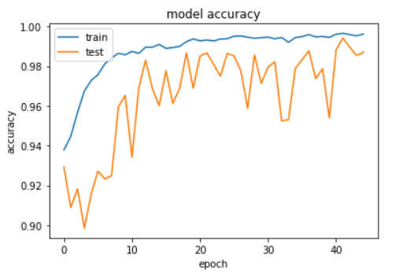
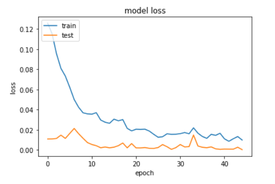
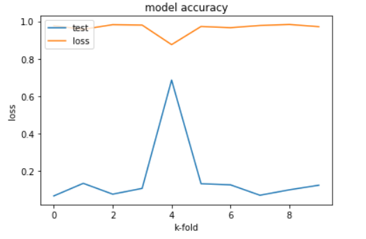

# Short Description

In this project, a dataset with over `100` features and at least `1000` samples is required to be trained in a supervised manner. It has been decided to use convolutional neural networks and support vector machine algorithms to do that.

# The Dataset

The dataset has about `~4200` samples and it's composed of images representing knifes, forks and spoons. It's basically a classification problem. The features are being represented by the actual pixels of each image. Each image has a resolution of `200 x 200` pixels and during the training phase, for both algorithms, the images get reduced to `140 x 140` pixels to reduce to computation time.

The only issue that has been encountered with the dataset was the lack of consistency between the train and test images. It took some time to figure that out, but once I shuffled all the data together and resampled the training and testing sets, it all went fine.

# Implemented Machine-Learning Algorithms

## CNN

I decided to go with Keras as the base library for training the CNN classifier. I really wanted to figure out on my own the right hyper-parameters of the model, so I spent copious amounts of time tweaking the model. The best one I could come up with is structured the following way starting with the input:

1. `Convolutional layer` with 32 filters and a 2D kernel size of 3.
1. `Max pooling` of size 3.
1. `Convolutional layer` with 64 filters and a 2D kernel size of 3.
1. `Max pooling` of size 2.
1. `Convolutional layer` with 128 filters and a 2D kernel size of 3.
1. `Max pooling` of size 2.
1. `Convolutional` layer with 128 filters and a 2D kernel size of 3.
1. `Max pooling` of size 2.
1. `Flattened` layer.
1. `NN layer` with 92 neurons.
1. `NN layer` with 92 neurons.
1. `NN layer` with 92 neurons.
1. `NN layer` with 3 neurons (just as many classes there are).

In between each convolutional layer I have used batch normalization to mitigate the internal covariance shift. By adding this kind of layers inbetween, the accuracy on the test set increases much faster than without.

Also, between each neural network layer, I have used a dropout of `30%` to reduce the chance of overfitting. I initially tried using dropout within the convolutional layers as well, but the accuracy was taking a hit.

I have used `ReLu` activation function everywhere except the last layer which must be a softmax. And I went with the `adam` optimizer because it's a very popular one and it takes care of many things.

Since I wanted to be really sure of what I was getting from it, I decided to validate the model with K-Folds, with a `K=10`.

The number of epochs was set to `45` and the batch size to `64`.

## SVM

For the SVM, I used `scikit-learn` library. The downside with SVM is that the training time takes a whole lot of time (dozens of hours) and that labels have to be flattened, which in the case of images, you loose information. That can be critical.

For the kernel, I decided to go with `rbf` because it's quite versatile when it comes to dealing with non-linearities. And I didn't want to take chances with a linear one or even polynomial given how much time training this takes.

Not knowing the right hyper-parameters, I opted for finding them out by grid-searching them. I went with the following possible values for the hyper-parameters:

1. `C`: *0.1, 1, 10, 100, 1000*
1. `gamma`: *0.1, 0.01, 0.001, 0.0001*

Also, just like with the CNN model, I went with K-Folds (`k=5`) to better evaluate the model. The final model ended up with a `C=10` and a `gamma=0.001`.

## Figures and Tables

Training the CNN model with Keras took roughly 2-3 hours on a GTX 1050 Ti. 
These are the tables generated after training the CNN model. The final test accuracy on it is sitting at `97.5%`. Pretty sweet! It's slightly overfit, but it seems to work anyway.

*Figure 1 - CNN model accuracy every epoch on test/train sets across all K-Folds*

*Figure 2 - CNN model loss every epoch on test/train sets across all K-Folds*

*Figure 3 - CNN model loss after each K-Fold*

On the other hand, the SVM model was really slow to train - roughly 20 hours on 3 cores. The prediction takes a lot of time which might not be ideal in production. Overall, it achieved a higher accuracy than the CNN model on all accounts (precision, recall, f1-score) with an average of `99%`. That being said, it's still overwhelmingly slow when compared to the CNN model (both in training and prediction times).

# Comments

The results are satisfactory. I was very surprised to see the SVM achieving a test score of `99%` and the CNN "only" getting `97.5%`. The loss across all epochs on the CNN decreases in an acceptable manner both on the training and validation set. The accuracy on the CNN model fluctuates as the model is trained on each epoch.

The SVM was again, very slow to train. The prediction times are really huge and I've got no explanation at the moment as to why that is. Maybe if there are too many support vectors out there, it may take a lot of time to come up with the prediction. Still, the only winning chip with SVM in this case is the train/test accuracies. 

# Conclusion

Overall, I was very satisfied with the results I got. In production, I'd definitely go with a CNN model because it trains much faster, you don't necessarily have to grid-search the ideal paramaters and because the prediction times are really fast - especially when done in batches. 

The reason you don't have to grid-search the ideal parameters is because there are so many trained models out there. You can just take one from this whole bunch, adjust it to your use case and then put it in production. 

Of course, going with an SVM might be a better fit in a different case, where maybe image classification isn't required. I'm thinking something with many less features. In that case other, non-black-box algorithms might be suited as well (like `Naive Bayes`).