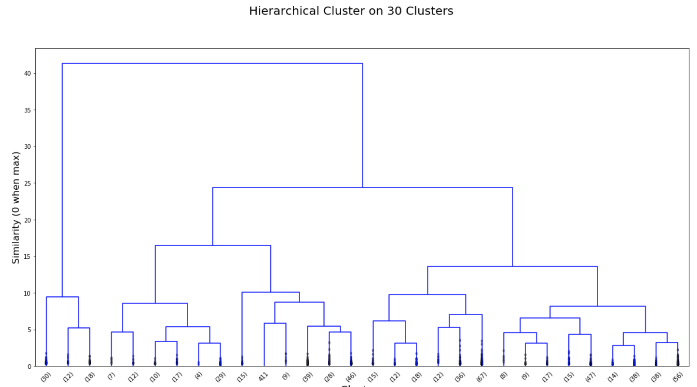
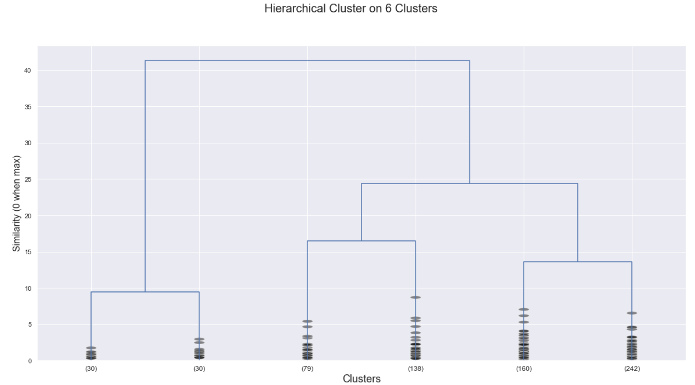
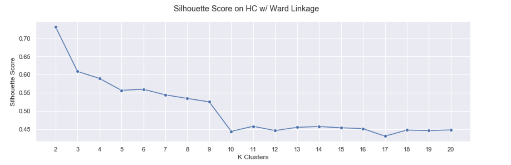
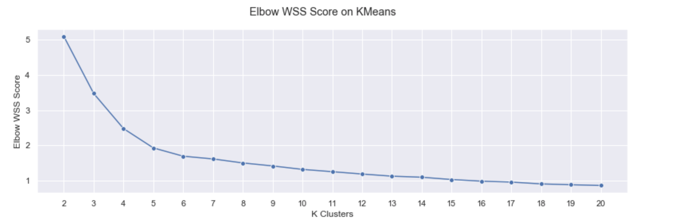
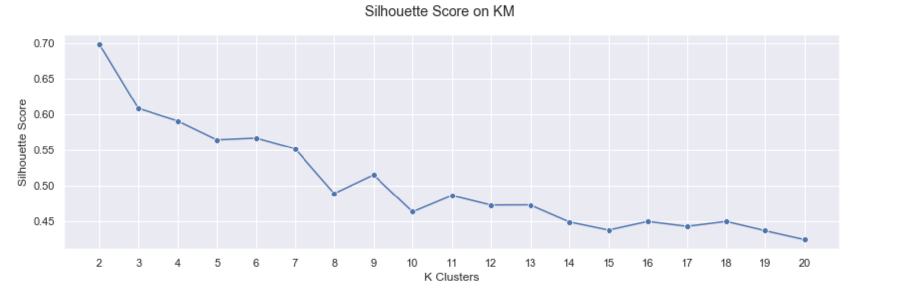
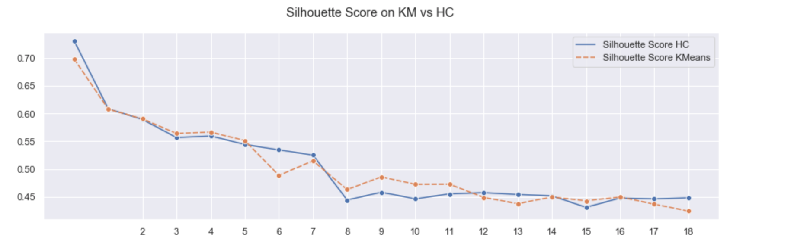

## Dataset Description

In this dataset, the undisturbed soil sample is the centerpiece of the measurement setup. The soil sample consists of bare soil without any vegetation and was taken in the area near Waldbronn, Germany.

The following sensors were deployed:

1. Cubert UHD 285 hyperspectral snapshot camera recording 50 by 50 images with 125 spectral bands ranging from 450 nm to 950 nm and a spectral resolution of 4 nm.
1. TRIME-PICO time-domain reflectometry (TDR) sensor in a depth of 2 cm measuring the soil moisture in percent.

## Description of Clusterization Methods

In this project, it was decided to go with two clusterization methods: Hierarchical Clustering and KMeans. Both of them are clustering methods.

### Hierarchical Clustering

The basic idea with hierarchical clustering is that you start with each point in its own cluster and then, for each cluster, use some criterion to choose another cluster to merge with (in our case it's the ward linkage criterion). Repeat this until you have only one cluster and you get get a hierarchy, or binary tree, of clusters branching down to the last layer which has a leaf for each point in the dataset. Once you have a cluster hierarchy you can choose a level or cut (according to some criteria) and take the clusters at that level of the tree.

You can also look at the dendrogram and try to pick a natural cut, but this is quite similar to finding the `elbow` across varying k values for K-Means. The `elbow` has to be quite pronounced and so the vertical branches in hierarchical clustering must have 

### KMeans

K-Means is the first choice when it comes to clustering algorithms for many simply because it is fast, easy to understand, and available everywhere (there’s an implementation in almost any statistical or machine learning tool you care to use). Similarly to hierarchical clustering, KMeans must be provided the number of desired clusters in order for it to work - it cannot determine the right number of clusters on its own. 

## Figures and Tables w/ Results

*Figure 1 - Hierarchical Tree w/ 30 Clusters*

*Figure 2 - Hierarchical Tree w/ 6 Clusters*

*Figure 3 - Silhouette Score on HC w/ Ward Linkage*

*Figure 4 - Elbow WSS Score on KMeans*

*Figure 5 - Silhouette Score on KMeans*

*Figure 6 - Silhouette Score on KMeans vs HC*

## Comments on the Results

In *figure 1*, we need to decide on the number of clusters we want to end up with for HC. There are a couple of approaches regarding this (both for HC and KMeans):
1. For HC and KMeans: The `silhouette` method. 
1. Just for HC: Looking at HC and deciding which number of clusters separates the best the dataset.
1. Just for KMeans: The `elbow` method.

The linkage criterion we're going with is the default one - `ward`. We shall not be using any other criterion.

In our case, when looking at the above hierarchical cluster, we can see the samples sort of pile up at the very bottom of the tree. That's a very good thing because it signifies that data has easily separable blobs of samples. Looking at it as it is, the best number of clusters that separates the data would be with `2` and that's because for `2` we get the longest vertical branches that aren't disturbed by tree splits.

But since the soil can't be divided in just 2 types (there are many more), we are going to look at the longest vertical lines that are still close to where the points are (that means going down in the tree). That number looks like it could be `5` or `6`. We'll go with `6`.

---

In *figure 2*, we see that `6` clusters separate the data quite well. The data points are still quite far from the next upper split in the branch, so there can't be much to ponder when predicting new labels.

---

Moving on to *figure 3*. Knowing that the Silhouette range is between `-1` and `1`, `-1` for having a really bad choice of clusters and `1` for having a perfectly separable dataset in the given number of clusters, we look at the above graph. We see that the highest score is achieved when the number of clusters is set to `2`.

Both the visual approach and the Silhouette one tell that the optimal number of clusters is `2`, but since we know there are multiple types of soil, we gotta choose one that's a tradeoff between these 2 criterias. `6` clusters also seem to achieve quite a high score, even slightly higher than with `5` clusters. We also notice that going beyond `9` clusters is going to yield a low score across all higher number of clusters.

---

In figure *4*, we see that the law of diminishing returns starts at a `K` of `6` or `7`. Since we already concluded that `6` is the number of optimal clusters with the HC analysis, we are biased towards thinking that `6` is also okay in this scenario. 

---

In *figure 5*, we see that setting `6` clusters for this dataset achieves a relatively good score when compared to all other data points in the chart and when taking into consideration the results from the elbow method. `6` clusters still achieve a slightly higher score than with `5` and that's fantastic.

---

In *figure 6*, we see that the graphs with the Silhouette scores are almost identical for each clustering method. We can safely judge that selecting `6` clusters for either method is the way to go.

## Conclusion

Both methods of clustering are very well known and commonly used. One of them gives a very good performance (KMeans) and the other one offers granularity over the dataset's similarity between data points. 

In our case, it looks like the optimal number of clusters is `6`. The dataset fits on both methods quite well and it is easily recognizable that there are multiple kinds of soils.